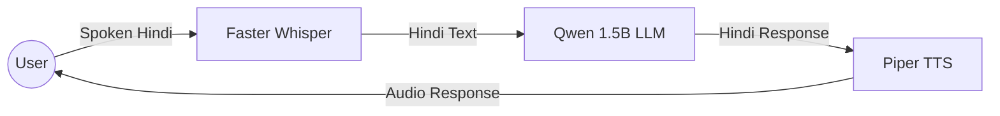

# Voice Model Hindi - Notebook Analysis

This document provides a detailed breakdown of the `voice_model_hindi.ipynb` notebook. It explains **what the code does**, **how it works**, and the **key technologies** used to build a conversational Hindi voice bot.

## 🎯 Project Goal
The notebook implements a **real-time, low-latency Hindi AI Voice Bot** capable of:
1.  **Listening**: Converting spoken Hindi audio into text.
2.  **Thinking**: Generating a relevant text response in Hindi using a Large Language Model (LLM).
3.  **Speaking**: Converting the AI's text response back into spoken Hindi audio.

## 🏗️ Architecture & Workflow

The system follows a classic **Ears -> Brain -> Mouth** pipeline:

## 🧩 Key Components

### 1. The Ears: Speech-to-Text (STT)
*   **Model**: `faster-whisper` (Implementation of OpenAI's Whisper model).
*   **Configuration**:
    *   **Size**: `medium` (Good balance of speed and accuracy).
    *   **Language**: Forced to `hi` (Hindi) to optmize for Hindi speech.
    *   **Beam Size**: `1` (Greedy decoding for faster inference).
    *   **Compute Type**: `float16` (Uses GPU acceleration).
*   **Function**: Takes a user's audio file recording and outputs a text string in Hindi.

### 2. The Brain: Large Language Model (LLM)
*   **Model**: `Qwen/Qwen2.5-1.5B-Instruct`.
*   **Why this model?**: It is a small but powerful 1.5 billion parameter model, heavily optimized for instruction following and multilingual support.
*   **Optimization**:
    *   **Quantization**: `4-bit` (Loaded using `BitsAndBytesConfig`). This drastically reduces VRAM usage, allowing it to run on consumer GPUs (like T4 on Colab).
*   **Persona**: The system prompt instructs the AI: *"You are a Hindi assistant. Reply ONLY in Hindi. Keep answers under 20 words."*
*   **Function**: Transforms the user's input text into a concise, relevant Hindi response.

### 3. The Mouth: Text-to-Speech (TTS)
*   **Model**: `Piper TTS` (A fast, local neural TTS system).
*   **Voice**: `hi_IN-pratham-medium.onnx` (A specific Hindi voice model).
*   **Preprocessing**:
    *   The `speak` function includes a cleaner that removes English characters and special symbols to prevent Piper from crashing or producing artifacts.
    *   It strictly allows only Hindi characters (`\u0900-\u097F`) and basic punctuation.
*   **Function**: Synthesizes the AI's text response into a `.wav` execution audio file.

## 💻 The Code Structure (`TurboHindiBot` Class)

The entire logic is encapsulated in a class called `TurboHindiBot`.

| Method | Role | Description |
| :--- | :--- | :--- |
| `listen(audio_path)` | **Input** | Transcribes audio file at `audio_path` to text using Whisper. |
| `think(user_text)` | **Process** | Sends `user_text` to Qwen LLM and generates a text reply. |
| `speak(text)` | **Output** | Cleans the text and runs a shell command to pipe it into `piper` to generate audio. |

## 🖥️ User Interface
*   **Library**: `Gradio`.
*   **Interaction**:
    *   Provides two inputs: **Microphone Request** and **File Upload**.
    *   Displays the conversation history (User text vs. AI text).
    *   Auto-plays the generated response audio.
*   **Mechanism**: The UI triggers the `run_chat` function whenever the user stops recording or uploads a file.

## 📦 Dependencies
The notebook requires installing several system and Python libraries:
*   **System**: `espeak-ng` (Required for Piper's phonemization).
*   **Python**: `faster-whisper`, `accelerate`, `bitsandbytes`, `gradio`, `piper-tts`, `transformers`.
